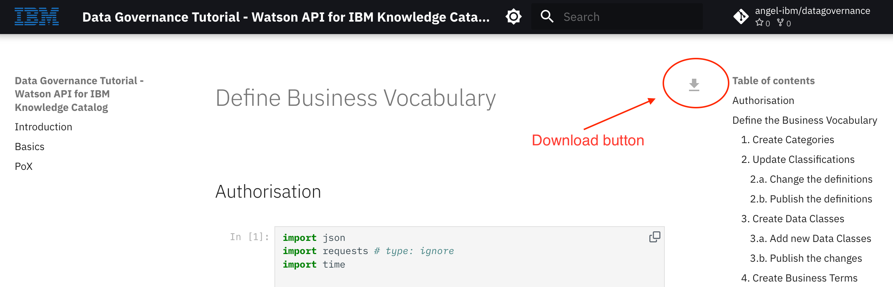
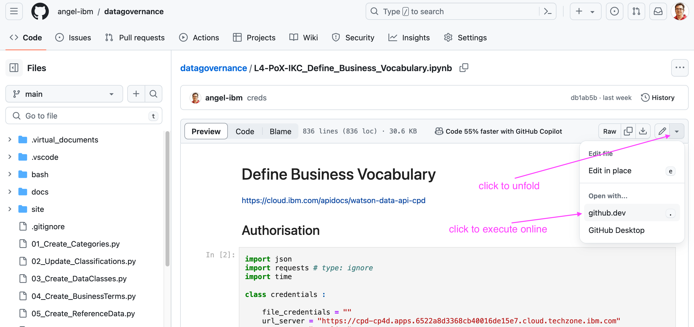
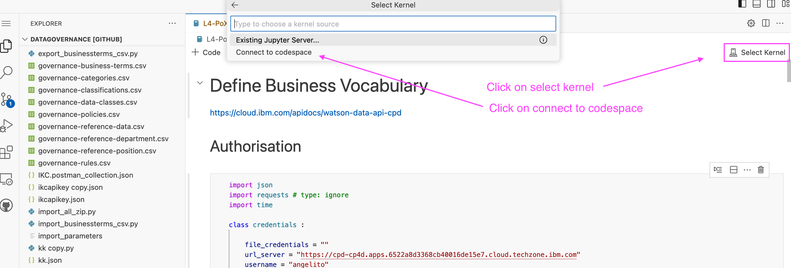
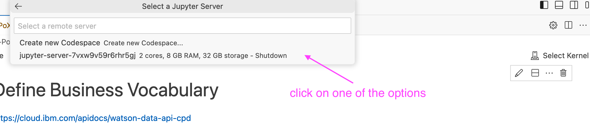
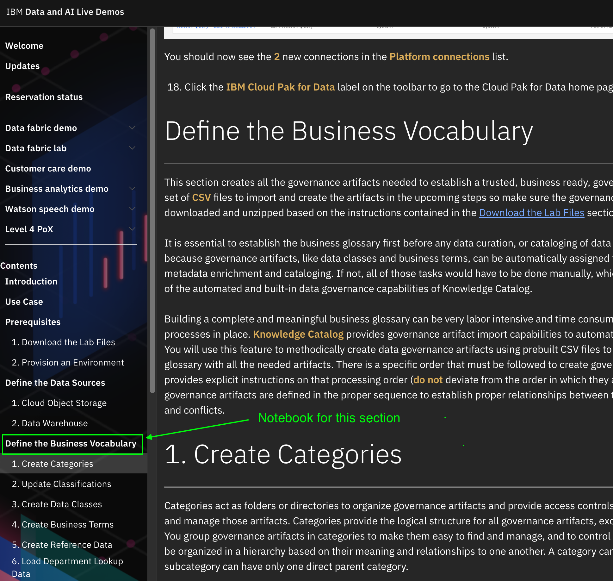
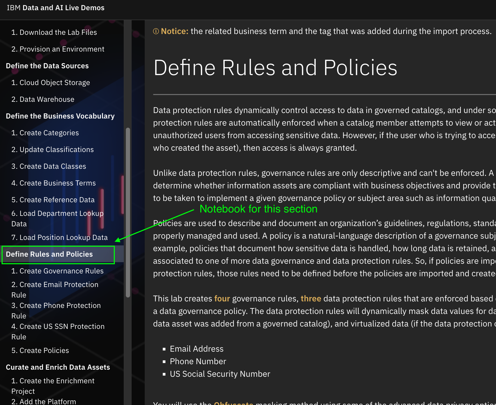

# Level 4 PoX - Knowledge Catalog

The following notebooks can be reviewed, the cells can be copied-and-pasted individually and the full code can be downloaded for convenience. Additionally, they can be executed online using, for example, the [github codespaces feature](https://github.com/features/codespaces)

## How to download a notebook to your laptop  

When you click on the link under the blue sections below for **displaying** the notebooks, you will see the download icon on the to right corner. Just klick on it to start downloading.

## How to run a notebook online  

When you click on the link under the magenta sections below for **accesing** the notebooks, you will be directed to the original github repository. Go to the right corner and unfold this menu:

Now, select the kernel and open in a codespace:

Then, click on one of the options:

## Define the Business Vocabulary  

!!! abstract "Display (and download) the notebook"
[Click to display and download the notebook](./Define_Business_Vocabulary.ipynb)

!!! example "Access the original notebook (and execute it online) "
[Click to access the actual file and execute it online](https://github.com/angel-ibm/datagovernance/blob/main/L4-PoX-IKC_Define_Business_Vocabulary.ipynb
)

## Define the Rules and Policies  

!!! abstract "Display (and download) the notebook"
[Click to display the notebook](./Define_Rules_and_Policies.ipynb)

!!! example "Access the original notebook (and execute it online) "
[Click to access the actual file and execute it online](https://github.com/angel-ibm/datagovernance/blob/main/L4-PoX-IKC_Define_Rules_and_Policies.ipynb)
