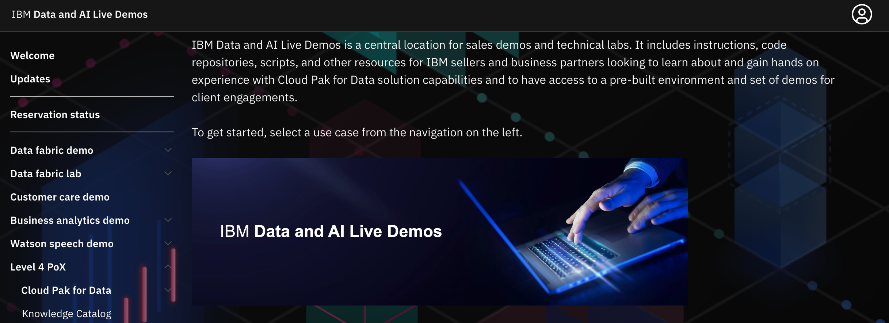
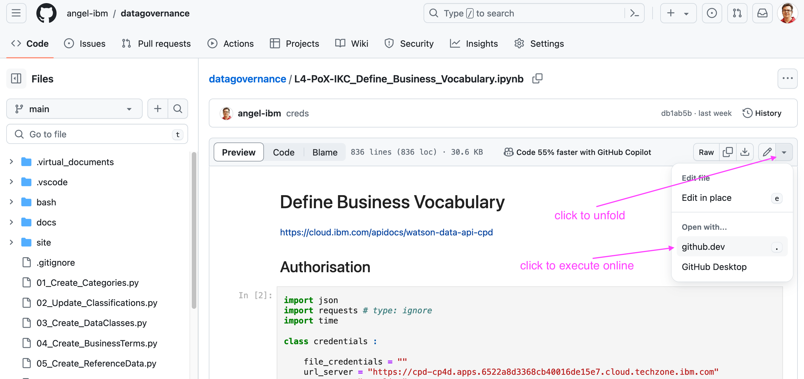
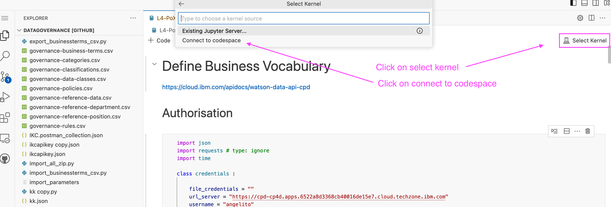
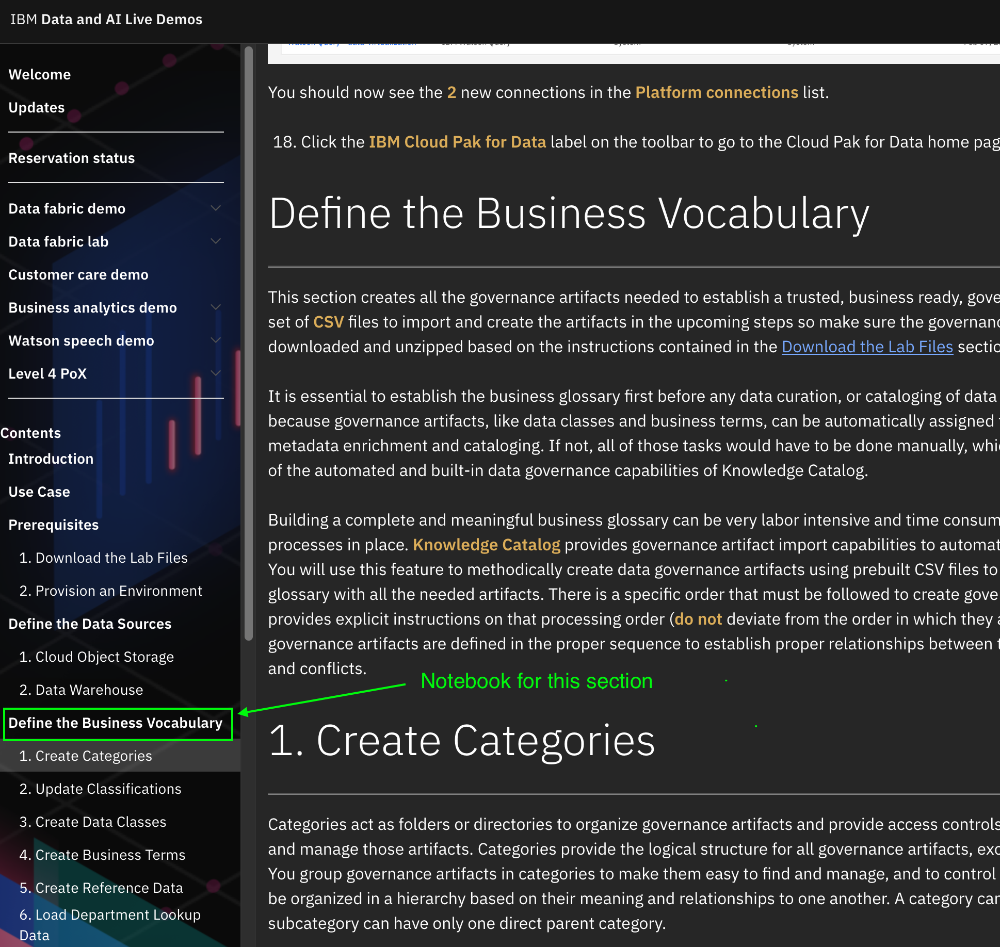
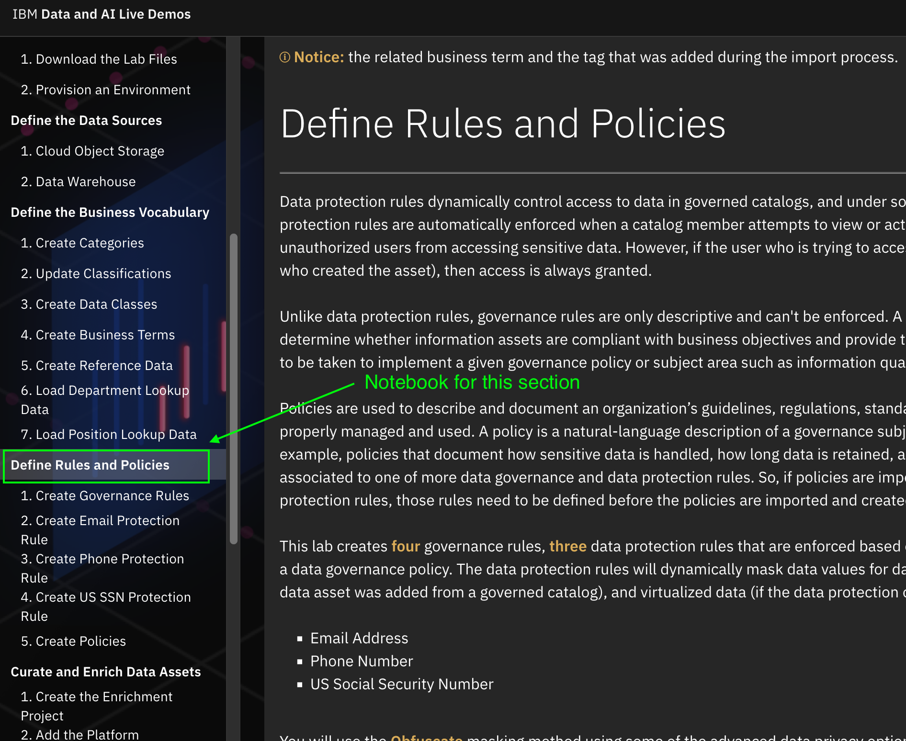

# Level 4 PoX - Knowledge Catalog

IBM Data and AI Live Demos is a web site that contains detailed instructions, code repositories, scripts, and various other tools for IBM sellers and business partners for learning and getting hands-on practice with Cloud Pak for Data solutions.

<https://cp4d-outcomes.techzone.ibm.com>

From all available resources, this documentation enhances the  [Level 4 PoX - Knowledge Catalog](https://cp4d-outcomes.techzone.ibm.com/l4-pox/knowledge-catalog) section by adding Jupyter notebooks to automate some tasks that may not be executed with the graphical user interface in real life projects like migrations, massive initial setup of governance artifacts, etc.

Several notebooks are provided here "as-is" for learning purposes. They are intended to be adapted to  the specific needs of a project, a demonstration, etc. They can be reviewed in this web site, the cells can be copied-and-pasted individually and the full code can be downloaded for convenience. Additionally, they can be executed online using, for example, the [github codespaces feature](https://github.com/features/codespaces) if the adequate Cloud Pak for Data environment has been provisioned.

## How to download a notebook to your laptop  

The blue sections below include a link for **displaying** the notebooks. If you click on them, the notebook will be shown and you will see the download icon on the top right corner. Just klick on it to start downloading.

Note that this link is just for reviewing and downloading the code. If you want to execute the notebook, you will need to store and run it from your laptop or in a proper enviroment like the one we will describe in the next section.

## How to run a notebook online

The magenta sections below contain a link for **accesing** the notebooks in the original github repository. If you click on it, you will be directed to the right location on github.com. Go to the right corner, unfold the menu and select `github.dev` as shown in this picture:

Now, go again to the top right corner, click on `select kernel` and then click on `open in a codespace`:

Then, click on one of the options:

Finally, you can execute the notebook as it would be local in your laptop. Note that we incorporate this feature to the documentation just for convenience, only to try small things quickly.  

### Show me how to run those notebooks online

## Sample Notebooks

### Define the Business Vocabulary  

This notebook automates all the tasks of the section `Define the Business Vocabulary`

!!! abstract "Display (and download) the notebook"
[Click to display and download the notebook](./Define_Business_Vocabulary.ipynb)

!!! example "Access the original notebook (and execute it online) "
[Click to access the actual file and execute it online](https://github.com/angel-ibm/datagovernance/blob/main/docs/pox/Define_Business_Vocabulary.ipynb)

### Define the Rules and Policies  

This notebook automates all the tasks of the section `Define Rules and Policies`

!!! abstract "Display (and download) the notebook"
[Click to display the notebook](./Define_Rules_and_Policies.ipynb)

!!! example "Access the original notebook (and execute it online) "
[Click to access the actual file and execute it online](https://github.com/angel-ibm/datagovernance/blob/main/docs/pox/Define_Rules_and_Policies.ipynb)
